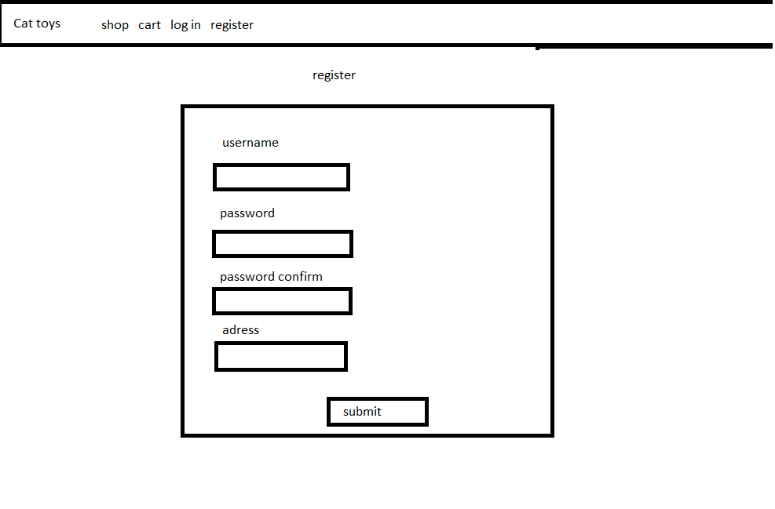

# Projektplan

## 1. Projektbeskrivning (Beskriv vad sidan ska kunna göra).
Tänker skapa en hemsida där man kan beställa leksaker till sin katt, där man kan lägga till x antal av en vara i korgen. Alla items ska kunna visas i affären men när man går in på ett items visas fler detaljer. Ska eventuellt lägga till darkmode som ändrar vad som finns i affären till saker såsom kattmynta (om jag hinner). Målet är en webshop där man som användare kan lägga till saker i korgen samt skapa konton osv, medan som admin kan lägga till nya items. 

## 2. Vyer (visa bildskisser på dina sidor).

## 3. Databas med ER-diagram (Bild på ER-diagram).

## 4. Arkitektur (Beskriv filer och mappar - vad gör/innehåller de?).
Alternativt: kolla in YARDOC

Översiktligt:
- app.rb innehåller alla routes.
- model.rb innehåller funktioner.
- layout.slim visar navbaren till sidorna.
- index.slim visar en basic landing page.
- error.slim visar ett felmeddelande beroende på vad man gjort fel.

- /users -mappen innehåller slimfilerna till login och register
   -  login.slim visar en inloggningssida
   -  register.slim visar en registreringssida
    
- /items -mappen innehåller alla funktioner relaterade till itemsen såsom:
   -  index.slim visar alla items
   -  new.slim visar ett formulär för att lägga till items
   -  edit.slim visar ett formulär för att redigera ett item
   -  show.slim visar ett enskilt item
    
- /cart -mappen innehåller slimfilerna till det i shoppingkarten
   -  index.slim visar allt man har i korgen
